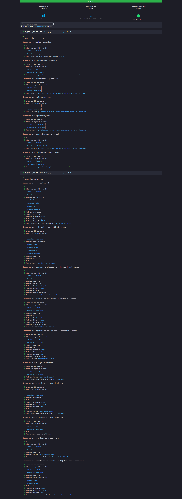

# Playwright Java Automation

This repository contains automated tests written in Java using the Playwright framework. The tests are designed to ensure the quality and functionality of the application under test.

## Table of Contents

- [Prerequisites](#prerequisites)
- [Installation](#installation)
- [Running Tests](#running-tests)
- [Directory Structure](#directory-structure)
## Prerequisites

Before you can run the Playwright tests, make sure you have the following installed:

- [Java Development Kit (JDK)](https://www.oracle.com/java/technologies/javase-downloads.html) (version 11 or higher)
- [Apache Maven](https://maven.apache.org/download.cgi) (version 3.6.3 or higher)
- [Node.js](https://nodejs.org/) (only if required for additional tooling)
- An IDE like [IntelliJ IDEA](https://www.jetbrains.com/idea/) or [Eclipse](https://www.eclipse.org/ide/)

## Installation

1. **Clone the repository:**

   ```bash
   git clone https://github.com/Gizkarabagas/TestBoboboxBagas-Gizkara
   cd TestBoboboxBagas-Gizkara
   ```

2. **Install dependencies:**

   Install the required Maven dependencies:

   ```bash
   mvn clean install
   ```

## Running Tests

1. **Run all tests:**

   To run all the tests in the suite, use the following command:

   ```bash
   mvn clean verify -Dtestng="testng.xml" -D"cucumber.filter.tags=@Test1"
   
   ```

## Directory Structure
```
+---.mvn
|   \---wrapper
\---src
    +---main
    |   +---java
    |   |   +---codegen
    |   |   +---config
    |   |   |   +---global
    |   |   |   \---playwright
    |   |   |       +---browser
    |   |   |       \---context
    |   |   +---data
    |   |   |   \---automation
    |   |   +---pageobject
    |   |   |   +---homepage
    |   |   |   +---login
    |   |   |   \---transaction
    |   |   \---utilities
    |   \---resources
    \---test
        +---java
        |   +---runners
        |   +---steps
        |   |   +---hompage
        |   |   +---login
        |   |   \---transaction
        |   \---testdata
        \---resources
            +---cluecumber-style
            \---features
                +---login
                \---transaction
```

## Here This Automation result Report

